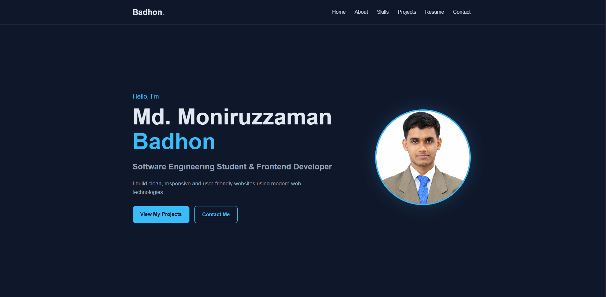

# 🌐 Personal Portfolio

A modern and responsive personal portfolio website showcasing my skills, projects, education, resume, and contact information.

🔗 **Live Website:**  
https://moniruzzaman-badhon.github.io/portfolio/

---

## 📸 Preview

<p align="center">
  
</p>

---

## ✨ Features

- 🏠 Modern hero section
- 👨‍💻 About Me section
- 🛠️ Skills showcase
- 🚀 Projects section
- 📄 Resume download
- 📧 Contact section
- 📱 Responsive design
- 🎨 Clean and user-friendly interface
- 📋 Navigation menu
- ⚡ Interactive JavaScript functionality

---

## 🛠️ Technologies Used

| Technology | Purpose |
|------------|---------|
| **HTML5** | Website structure and semantic markup |
| **CSS3** | Styling, layout, animations, and responsive design |
| **JavaScript** | Interactive functionality and DOM manipulation |

---

## 💻 Skills Showcased

- HTML
- CSS
- JavaScript
- React
- Node.js
- MySQL
- Git & GitHub
- REST API

---

## 🚀 Projects Featured

### 🛒 Vendor Link Market
A full-stack web application designed to connect customers with vendors and products.

**Technologies:** React, CSS, Node.js, Express.js, MySQL

### 🎵 Music Player
A responsive JavaScript music player with playback, progress, and volume controls.

**Technologies:** HTML, CSS, JavaScript

### 📋 Form Validation
A web application for validating user input and ensuring required information is correctly entered.

**Technologies:** HTML, CSS, JavaScript

---

## 📂 Project Structure

```text
portfolio/
│
├── files/
│   ├── images/
│   └── resume/
│
├── index.html
├── style.css
├── script.js
└── README.md
```


📚 What I Learned
---
Through this project, I practiced:

- Semantic HTML structure
- Responsive CSS layouts
- JavaScript DOM manipulation
- Interactive navigation
- Responsive navigation menu
- Building reusable UI sections
- Portfolio website design
- Organizing frontend projects
- Deploying a website with GitHub Pages
---


🔮 Future Improvements
---
⚛️ Rebuild the portfolio using React
🌙 Add Dark / Light mode
✨ Add more advanced animations
📊 Add project filtering
📬 Improve contact form functionality
🚀 Add more projects and case studies
📱 Further optimize mobile experience


👨‍💻 Author
---
Md. Moniruzzaman Badhon

Software Engineering Student | Frontend Developer

<p> <a href="https://github.com/Moniruzzaman-Badhon">  </a> <a href="https://www.linkedin.com/in/moniruzzaman-badhon-b50153308/">  </a> <a href="https://moniruzzaman-badhon.github.io/portfolio/">  </a> </p>


If you like this project, consider giving the repository a star!

<p align="center"> Built with ❤️ using HTML, CSS & JavaScript </p> 

